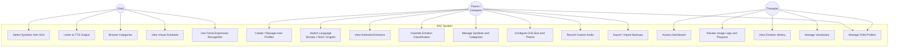

# Use Case Diagram - AAC System

```mermaid
graph TB
    subgraph AAC System
        UC1[Select Symbols from Grid]
        UC2[Listen to TTS Output]
        UC3[Browse Categories]
        UC4[View Visual Schedule]
        UC5[Use Facial Expression Recognition]
        UC6[Create / Manage User Profiles]
        UC7[Switch Language<br>Sinhala / Tamil / English]
        UC8[View Detected Emotions]
        UC9[Override Emotion Classification]
        UC10[Manage Symbols and Categories]
        UC11[Configure Grid Size and Theme]
        UC12[Record Custom Audio]
        UC13[Export / Import Backups]
        UC14[Access Dashboard]
        UC15[Review Usage Logs and Progress]
        UC16[View Emotion History]
        UC17[Manage Vocabulary]
        UC18[Manage Child Profiles]
    end

    Child((Child))
    Caregiver((Parent /<br>Caregiver))
    Therapist((Therapist))

    Child --> UC1
    Child --> UC2
    Child --> UC3
    Child --> UC4
    Child --> UC5

    Caregiver --> UC6
    Caregiver --> UC7
    Caregiver --> UC8
    Caregiver --> UC9
    Caregiver --> UC10
    Caregiver --> UC11
    Caregiver --> UC12
    Caregiver --> UC13
    Caregiver --> UC18

    Therapist --> UC14
    Therapist --> UC15
    Therapist --> UC16
    Therapist --> UC17
    Therapist --> UC18
```
